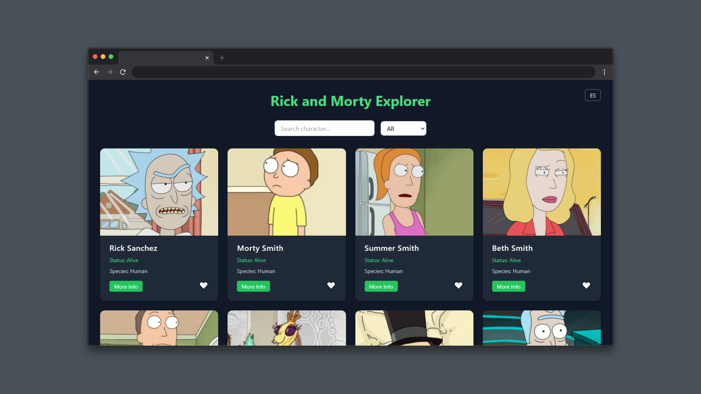
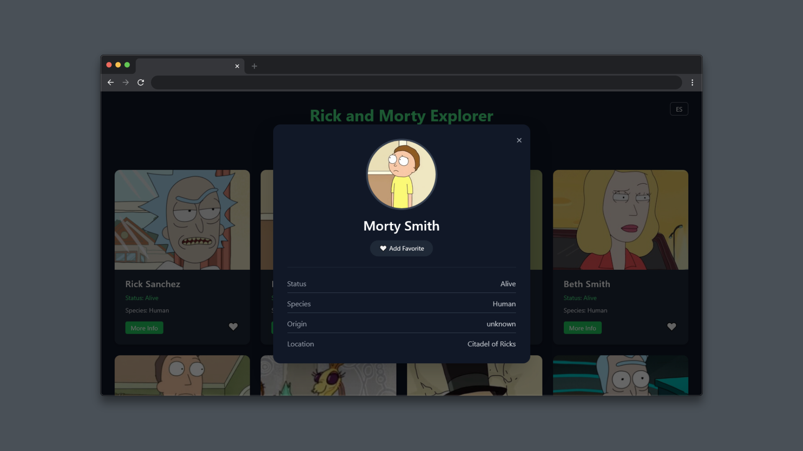
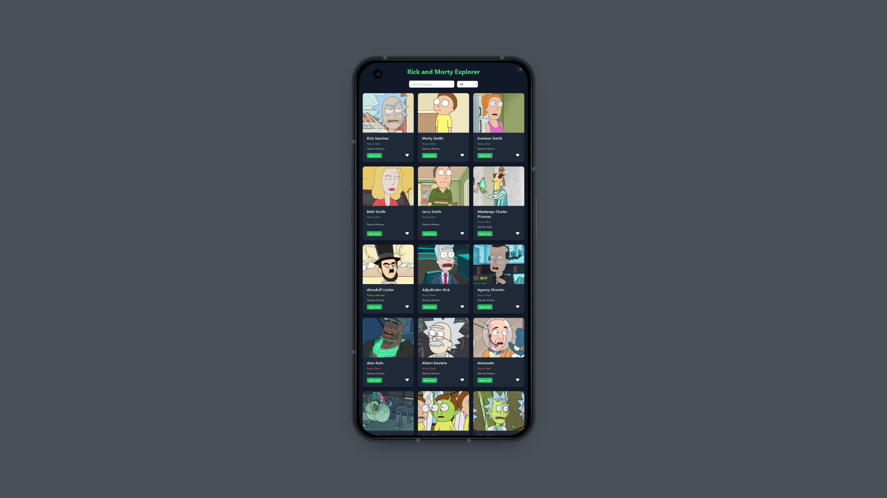

# 🎬 Rick and Morty Explorer

[](https://developer.mozilla.org/en-US/docs/Web/JavaScript) 
[](https://tailwindcss.com/)
[](https://rickandmortyapi.com/)

Rick and Morty Explorer es una **aplicación web interactiva** que permite explorar personajes de la famosa serie animada.  
Consume la **API oficial de Rick and Morty** y permite a los usuarios buscar, filtrar y marcar personajes como favoritos.  
Está diseñada con **JavaScript modular**, **Tailwind CSS** y sigue buenas prácticas de arquitectura de frontend.

---

## 🌟 Demo en vivo

> [https://alex3034.github.io/rick-and-morty-explorer/](https://alex3034.github.io/rick-and-morty-explorer/)

---

## 🖼 Capturas de pantalla

**Listado de personajes y búsqueda:**



**Modal con información detallada y favoritos:**



**Mensaje “No characters found” centrado:**


**Modal con información detallada y favoritos:**



---

## 🚀 Características principales

- **Listado de personajes** con:
  - Imagen
  - Nombre
  - Estado (Alive, Dead, Unknown)
  - Especie
- **Búsqueda y filtros**:
  - Por nombre
  - Por estado
  - Por especie
- **Paginación** entre resultados
- **Favoritos**:
  - Marcar personajes en card o modal
  - Persisten usando `localStorage`
- **Modal informativo** con detalle del personaje
- **Mensaje vacío** para búsquedas sin resultados
- **Diseño responsive** para mobile, tablet y desktop

---

## 🛠 Tecnologías utilizadas

- **HTML5 / CSS3 / Tailwind CSS**  
- **JavaScript (ES6+)**  
- **API de Rick and Morty**  
- **LocalStorage** para persistencia de favoritos  
- Modularización del código en varios archivos JS:
  - `render.js`, `modal.js`, `favorites.js`, `api.js`

---

## 🏗 Estructura del proyecto

```
rick-and-morty-explorer/
│
├─ index.html
├─ src/
│   ├─ styles.css
│   ├─ main.js
│   ├─ api.js
│   ├─ render.js
│   ├─ modal.js
│   └─ favorites.js
└─ assets/
    ├─ favicon.ico
    └─ screenshots/
        ├─ listado.png
        ├─ modal.png
        ├─ empty-state.png
        └─ mobile.png
```

---

## 🎨 Diseño y experiencia de usuario

- **Cards modernas** con hover y sombra suave  
- **Modal minimalista** con información clara y botón de favoritos  
- **Estados vacíos claros** y centrados  
- Paleta de colores oscura, coherente con la temática de la serie  

---

## 💡 Mejoras futuras (Extras opcionales)

- Sección para **ver solo los favoritos**  
- Favicon personalizado  
- Traducción completa de la aplicación (botón de idioma)  
- Posible sección de **episodios de cada personaje**  

---

## ⚡ Cómo usar

1. Clona el repositorio:

```bash
git clone https://github.com/TU_USUARIO/rick-and-morty-explorer.git
```

---

## 👨‍💻 Autor

Desarrollado por **Alejandro Herrera**  
Proyecto creado como parte de mi proceso de aprendizaje en Frontend Development.
